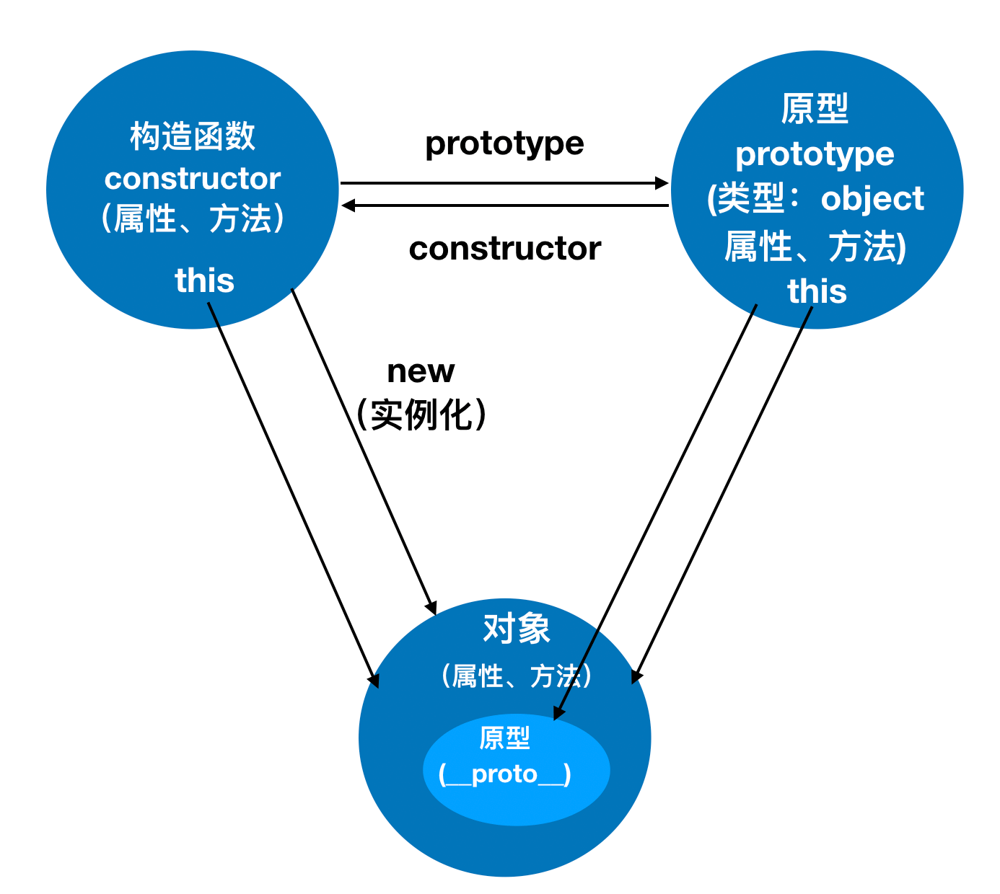

##	面向对象（OOP：Object Oriented Programming）

## 课前准备

- 工具
  - 编辑器 VSCode
  - 浏览器 Chorme
- 前置知识
  - Js基本知识

## 课堂主题

- 对象的创建
- 工厂模式
- new运算符
- 构造函数
- 原型prototype
- 面相对象和面相过程编程
- 类和对象概念

## 课堂目标

- 理解面相对象思想
- 会使用工厂模式
- 会使用new运算符
- 会使用构造函数
- 理解原型
- 理解类和对象

  

### 面向对象编程思想

 一、面相过程：注重解决问题的步骤，分析问题需要的每一步，实现函数依次调用；

 二、面相对象：是一种程序设计思想。将数据和处理数据的程序封装到对象中；

 三、面相对象特性： 抽象、 继承、封装、多态

优点：提高代码的复用性及可维护性；

​	

##对象

Javascript 是一种基于对象的语言，几乎所有东西都是对象；

1、对象创建方法：

- 字面量创建

- new Object()创建

- Object.create()创建：创建对象的原型；

  

## 工厂模式

一、工厂模式

工厂模式解决了代码复用的问题；

### 对象和类

​	一、对象：具体的某个事物；(如：小明、叮当猫)

​	二、类：一类事物的抽象；(如：人类、猫类)

##new运算符

- new的特点：1.new只能函数 2.自动创建空对象； 3.this绑定到空对象；4 隐式返还this；
- 通过new来改造工厂模式

##构造函数

- 构造函数要通过new来调用 this指向Student
- 约定俗成构造函数首字母大写
- 静态属性及方法
  - 静态方法里的this；
  - 扩展功能；

##构造函数性能

- 公共空间存放公共方法

##构造函数原型

### prototype原型

- 通过new实例化出来的对象其属性和行为来自两个部分，一部分来自构造函数，另一部分来自原型。
- 当声明一个函数的时候，同时也申明了一个原型 。
- 原型本身是一个对象。
- 对象属性方法查找规则；

### 原型构造函数及对象关系

### 

### 工厂模式对比构造函数

1.但是却没有解决对象识别的问题。即创建的所有实例都是Object类型。(不清楚是哪个对象的实例)

2.没有原型，占用内存。

### 原型链

原型链是指对象在访问属性或方法时的查找方式。

1.当访问一个对象的属性或方法时，会先在对象自身上查找属性或方法是否存在，如果存在就使用对象自身的属性或方法。如果不存在就去创建对象的构造函数的原型对象中查找 ，依此类推，直到找到为止。如果到顶层对象中还找不到，则返回 undefined。

2.原型链最顶层为 Object 构造函数的 prototype 原型对象，给 Object.prototype 添加属性或方法可以被除  null 和 undefined 之外的所有数据类型对象使用。

## 总结

​    1）面向对象编程

​	2）工厂模式

​	3）new运算符

​	3）构造函数

​	4）原型

​	5）面相对象和面相过程编程

​	6）类和对象

## 下节课预告

​	1)面向对象02

